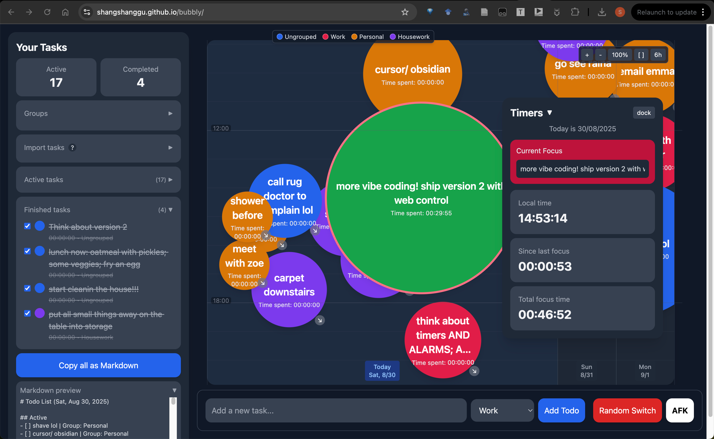

# Bubbly

A visual task management application where todos appear as floating bubbles on a canvas. Focus on tasks with built-in timers and organize your work in an intuitive, spatial interface.

## Overview

Bubbly is a "抓阄" (lottery-style) task management tool designed for brain dumping and visual task organization. Rather than traditional list-based todo apps, Bubbly presents tasks as floating bubbles on a time-organized canvas, making task management more engaging and spatially intuitive.

## Key Features

- **Visual Bubbles**: Draggable, resizable task bubbles on a canvas
- **Time Organization**: Tasks positioned by time (Y-axis) and date (X-axis)
- **Group Management**: Color-coded task categorization
- **Focus Tracking**: Built-in timers with total focus time tracking
- **Task Import/Export**: Support for Markdown, plain text and other formats
- **AFK Mode**: Oh I just like the word away-from-keyboard to stand for taking a quick break, and I think people are not using it enough

## Usage

### Getting Started
1. Open the application in your web browser
2. Add your first task using the bottom input bar
3. Click on a bubble to select and focus on it
4. Use the action bar to start timing, pause, or complete tasks

### Task Management
- **Add Tasks**: Type in the bottom input bar and press Enter or click "Add Todo"
- **Focus on Tasks**: Click any bubble to select it and see the action bar
- **Start Timing**: Click "Start" in the action bar to begin focus tracking
- **Complete Tasks**: Click "Complete" to move tasks to the finished list
- **Random Selection**: Use "Random Switch" to let the app choose your next task

### Organization
- **Groups**: Create and manage task groups in the left panel settings
- **Colours**: Customize group colours for visual organization
- **Positioning**: Drag bubbles around the canvas to organize spatially
- **Sizing**: Resize bubbles using the bottom-right handle (↘)

### Import/Export
- **Import Formats**: 
  - Markdown checkboxes: `- [ ] task` or `- [x] completed`
  - Plain text: one task per line
  - Bullet points: `•`, `-`, `*`
  - Apple Notes: `☐` and `☑`
  - **Enhanced tabular format**: Full metadata tables with positioning, timing, and group information
- **Export Options**:
  - **Simple**: Clean Markdown checkboxes for universal compatibility
  - **Full**: Comprehensive tables with all metadata (timing, coordinates, groups, status)
- **Backward Compatibility**: Import previously exported full-format data to restore exact positioning, timing history, and group assignments

## Technical Details

- **Frontend**: React 18 with JSX (Babel in-browser compilation)
- **Styling**: Tailwind CSS with custom animations
- **Storage**: Browser localStorage for persistence
- **Responsive**: Mobile-friendly interface with adaptive layouts

## Browser Compatibility

Bubbly works in all modern web browsers that support:
- ES6+ JavaScript features
- CSS Grid and Flexbox
- localStorage API
- Modern DOM APIs

## Important Note

All data is stored in your browser's localStorage and will be lost if you refresh the page. This project currently lives in a single HTML file with no server-side storage.

## Live Demo

Visit the live application: [https://bubbly.sh/)

## Development

This is a single-file application (`index.html`) that can be opened directly in any web browser. No build process or server required.

## License

Open source project - feel free to use, modify, and distribute.
